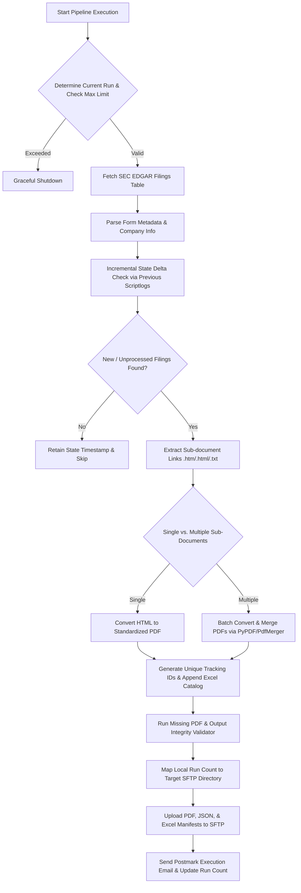

# 🏛️ SEC Regulatory Filings Ingestion & Automation Suite

[](https://www.python.org/)
[](https://www.selenium.dev/)
[](https://pypi.org/project/pdfkit/)
[](#)

An enterprise-grade regulatory data mining system that continuously monitors, ingests, and normalizes **SEC EDGAR filings** across **Corporate Actions (CA - 30 Form Types)** and **Share Offerings (SO - 8 Form Types)**. Converts multi-document HTML filings into consolidated PDFs, validates output integrity, tracks run state logs, and synchronizes data with secure remote SFTP directories.

---

## 🏗️ Architecture & Processing Workflow



## 🛠️ Key Engineering Features
- 📑 Comprehensive Coverage (38 SEC Form Types):
  - Corporate Actions (CA): Ingests 30 form types including 8-K, 6-K, F-1, S-1, PRE 14A, SC TO-T, etc.  
  - Shares Outstanding (SO): Monitors 8 key forms including 10-K, 10-Q, 20-F, DEF 14A, F-3, S-3, DEF 14C, DEFC14A.  
- ⏱️ Incremental Delta Ingestion: Uses state tracking logs (scriptlog.txt & scriptlog1.txt) to process only new filings accepted after previous run timestamps, avoiding duplicate processing.  
- 📄 Dynamic Document Rendering & PDF Merging: Renders HTML filings using pdfkit (wkhtmltopdf wrapper) and merges multi-part document exhibits into a single clean PDF via PyPDF / PdfMerger.  
- 🔍 Missing File & Integrity Validation Engine: Cross-checks catalog Excel records against generated PDF files; auto-triggers retry downloads for any missing artifacts.  
- 🗺️ Intelligent SFTP Directory Mapping & Weekend Rules: Automatically maps local run iterations (e.g., Run 1, 1A, 2...) to structured SFTP date/run directories while applying automated weekend transmission skip rules.  
- 📬 Automated Status & Exception Dispatch: Generates run manifests in JSON format and sends operational alerts via Postmark API.

---

## 🛠️ Tech StackCore: 
- Python 3.9+  
- Web Automation: Selenium WebDriver, ChromeDriverManager  
- Document Processing: PDFKit (wkhtmltopdf), PyPDF, PyPDF2, Openpyxl  
- Data & Parsing: Pandas, RegEx, BeautifulSoup/XML Parsing  
- Infrastructure: Paramiko (SFTP), Postmarker API, Dotenv

---

## ⚙️ Configuration & Setup
1. Prerequisites
- Python 3.9 or higher
- Google Chrome browser
- wkhtmltopdf binary installed locally and added to environment variables  

2. InstallationClone the repository and install required packages:
```
git clone [https://github.com/nivethamanoharan/sec-compliance-data-pipeline.git](https://github.com/nivethamanoharan/sec-compliance-data-pipeline.git)
cd sec-compliance-data-pipeline
pip install -r requirements.txt
```

3. Environment File Setup
Create a .env file in the root directory:
```
SFTP_HOST=sftp.example.com
SFTP_USER=your_username
SFTP_PASS=your_password
SFTP_PORT=2022
SFTP_BASE_PATH=/uploads/sec_filings/
```

---

## 🚀 Pipeline Execution
Run Corporate Actions pipeline:
```
python SEC_CA_Startup.py
```
```
python SEC_SO_Startup.py
```

---

## 📊 Sample Output Schema (Manifest Excel)
| Field | Type | Description | 
|-------|------|-------------|
| Sno | Integer | Row index sequence  
| UniqueID | String | Generated unique identifier (e.g., CA24... or SO24...)  
| Form Type | String | SEC Form designation (8-K, 10-K, S-1, etc.)  
| URL | String | SEC EDGAR source filing URL  
| Filename | String | Normalized output PDF filename
| Remarks | String | Processing flags (e.g., numeric unit indicators)

---

## 📧 Author & Connect
#### Nivetha Manoharan
> Software Developer (Data Engineering & Automation)
- 💼 LinkedIn: linkedin.com/in/nivethamanoharan  
- ✉️ Email: nivemanoharan2001@gmail.com  
- 📍 Status: Open to relocation to UAE | Immediate Availability 
